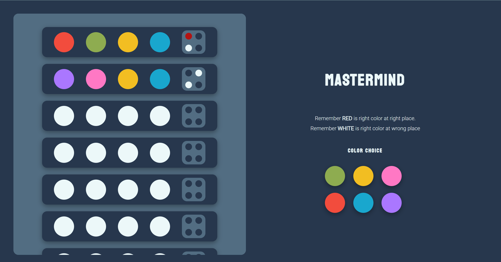
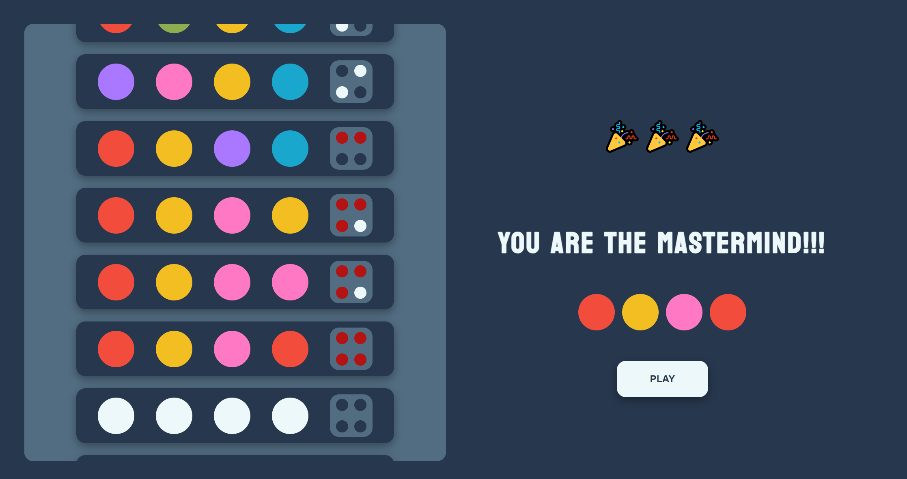
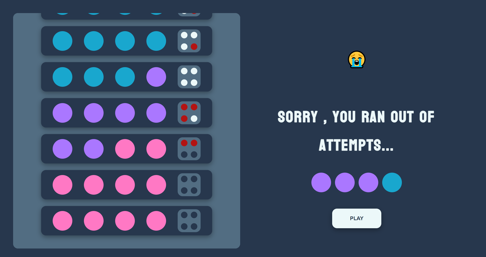

# MastermindGame

Mastermind is a code-breaking game, where one player has guess the code (randomly generated) with a limited number of attempts(10). The code consists of a sequence of colors.
The player has to use logical deduction and the feedback provided to guess the secret code.

>>Initial: Generate a set of 4 colors randomly. Each color can be used more than once. The code is kept secret all along the game.

>>Guess: The player starts by making the first guess, attempting to replicate the secret code. The guess is made by selecting four colors in a specific order.

>>Evaluation: After each guess, some feedback will be generated on the correctness of the guess. The feedback consists of two elements:

>>The number of exact matches, the colors match both in color and position to the secret code.

>>The number of color matches, this is the correct in color but in the wrong position.
   
>>Feedback: the player continues making guesses, using the feedback provided to make better guesses. 
>>

>>Winning: The game ends when the code breaker successfully guesses the secret code, matching all colors and positions, in less than the given number of attempts. 
>>

>>Losing: If the player is unable to guess the secret code within the 10 attempts,he loose.
>>

>>New Game: After the game ends, players can start a new game.

For this Project, I have used HTML, CSS and Javascript.
