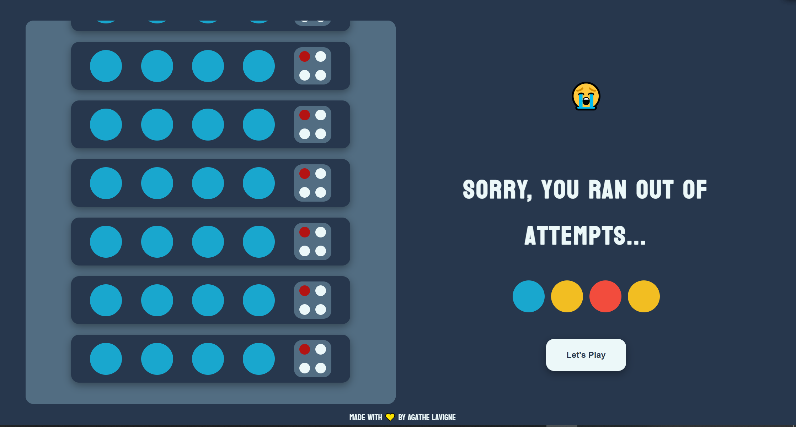

# MastermindGame

<h3>What is mastermind?</h3>

Mastermind is a code-breaking game, where one player has to guess the code of 4 colours (randomly generated), within a limited number of attempts, in this case 10. 
The player has to use logical deduction and the feedback provided to guess the secret code.
The secret code can have many times the same colour!!!

<h3>About this project</h3>

This is a solo project, and first of many others to come.
My approach was to begin with making the wireframe of the Game, as I was already familiar with it, the UI was rather clear in my mind and easy to make.
The steps of the functionality were clear too.

See the Wireframe and Pseudo Code below for more details.

<h3>Wireframe</h3>

I used Figma for the wireframe :

<h3>Pseudo code + Technology used</h3>

=>HTML: Divide the screen in half, the left side shows the player's choices of code and the right side gives reminder of the feedback colour code and the colour choice buttons for the player to click on, and a play button.
 
	1.Left side: board side with 10 place of guesses code,
 
	2.Right side: Title of the game , h2Tag of the goal and an pTag as a reminder of the feedback conditions, and buttons of colour for the player to choose.
	

=>CSS: 	Make the UI simple and enjoyable to use,

		Create a scrollable section for the board, but the page with stay still,

  		Use 6 different colours for the colour Choice,

		BONUS: make it mobile responsive.

=>JavaScript:  	Create functionality of the Game with Javascript
	
 	1.Generate a secret code, using a for loop.

	2.Player's choice of code breaking, addEventListener to each colour button.
 
	3.Store Player's choice and display it on the screen,using the ID of the buttons Tag (of the colour) and push it in an object of 10 arrays, 1 array would be of 	4 items representing the guesses.
 
	4.Compare the secret code after each guess, once the guess has reached the amount of 4 items, run a function to comprare the secret code to the player guess.
 
	5.Check each colour of the player code and display feedback (right colour + right place and right colour), using a for loop check if the index of player guess match exactly the secret code index and use array method to check if player guess includes some of the colour code.
 
	6. Display the feedback, set an attribute id to a specific div.
 
	7.If the Player's code has 4 right colours at the right place then, we've got a winner, Change the right side of the screen rendering Winning message with the secret code and a play button.
 
	8.If the Player's choice isn't correct then carry on the game, using a if statment in the compare function,
 
	9.Once the Player reach 10 attempts and all guesses are wrong then, the player loses, Change the right side of the screen rendering Loses message with the secret code and a play button.
 
	10.Play again button, add a click eventListener to clear the board , empty the player guess object, and re-generate a new secret code.

	11.Add sounds for a better user experience.

	12.BONUS: add a timer.

<h3>Final Result</h3>

<a href="https://agathelouiselav.github.io/MastermindGame/">Link to Mastermind Game</a>

The BONUS are in progress...

<h3>Challenges</h3>

Displaying the player choices was difficult at first, and so the feedbacks.
I also had a problem with a click which was going in the air.
Jest was installed for this project,I wanted to use it to test my code but realised I need to learn more about it to use it correctly. 
I have done my best to make the code readable and DRY.
This project was a great learning opportunity for me, I was able to put all I've learned into practice. I am still learning from my mistakes, but enjoying every moment of it.

<h3>Futur Opportunities</h3>
	
		-create levels of the game,
		-add more colours,
		-new UI design.
